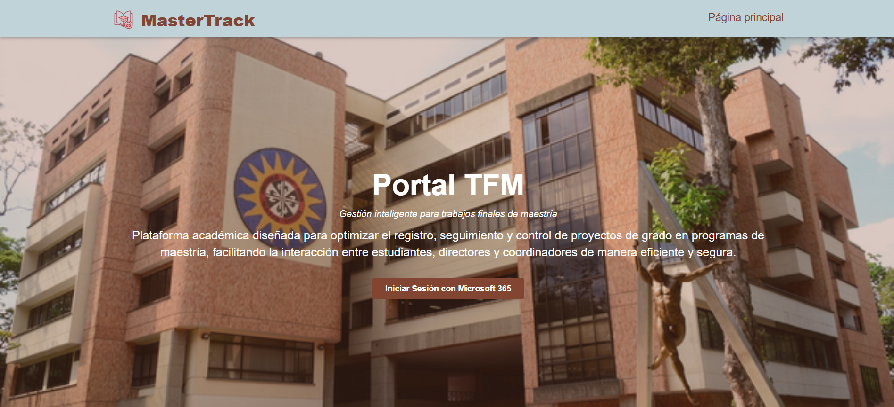
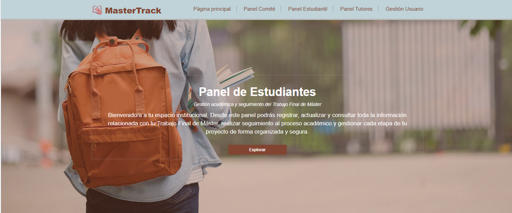
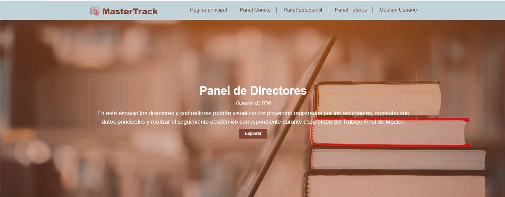
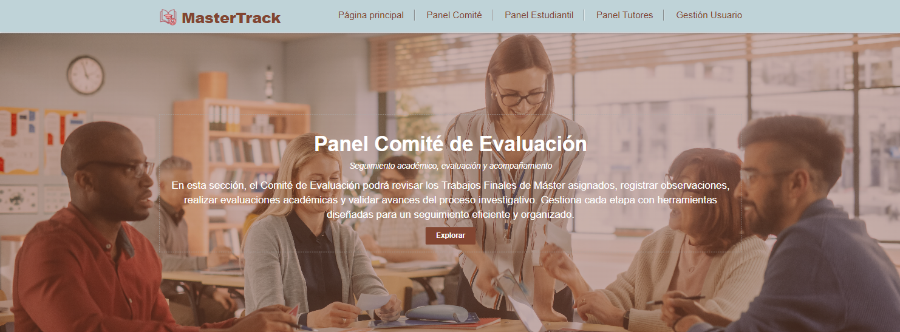
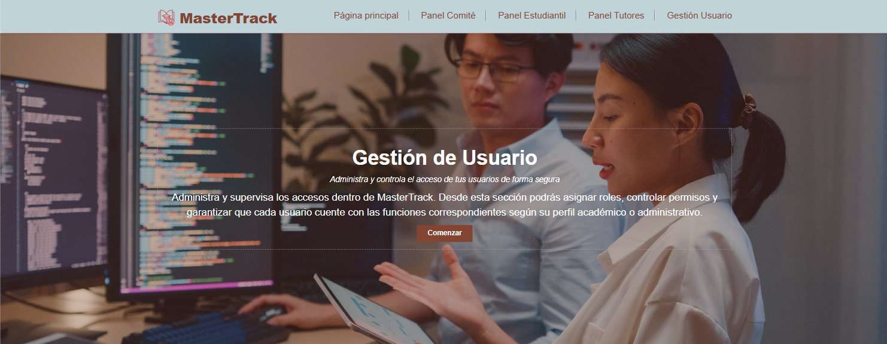

# 🎓 MasterTrack

### Plataforma Inteligente para la Gestión de Trabajos de Fin de Máster (TFM)

 
 
 

 
 
 

---

# 📌 Descripción del Proyecto

**MasterTrack** es una plataforma web desarrollada para optimizar y digitalizar el proceso de gestión de Trabajos de Fin de Máster (TFM) dentro de instituciones académicas.

El sistema permite centralizar el registro, revisión, seguimiento, aprobación y evaluación de proyectos académicos mediante automatización de procesos, control de estados y gestión documental.

La plataforma fue desarrollada utilizando tecnologías de Microsoft Power Platform, integrando herramientas como Power Pages, Dataverse y Power Automate para mejorar la eficiencia administrativa y académica.

---

# 🚀 Objetivos del Proyecto

- Digitalizar el proceso de gestión de TFM.
- Automatizar procesos académicos y administrativos.
- Mejorar la trazabilidad de los proyectos.
- Centralizar documentación y seguimiento.
- Facilitar la interacción entre estudiantes, tutores y comité académico.
- Implementar notificaciones automáticas mediante correo electrónico.

---

# 👥 Actores del Sistema

| Rol | Función |
|---|---|
| 👨‍🎓 Estudiante | Registra y envía el TFM |
| 👨‍🏫 Tutor | Revisa, corrige y aprueba el TFM |
| 🧑‍💼 Profesor Seminario II | Evalúa y asigna estado |
| ⚙️ Administrador | Gestiona usuarios y configuración |

---

# 🛠️ Tecnologías Utilizadas

| Tecnología | Función |
|---|---|
| Microsoft Power Pages | Portal Web |
| Microsoft Dataverse | Base de datos |
| Power Automate | Automatización de procesos |
| Microsoft 365 | Notificaciones y autenticación |
| Azure Active Directory | Gestión de acceso |
| GitHub | Control de versiones |

---

# 🔐 Características del Sistema

✅ Inicio de sesión institucional  
✅ Gestión de roles de usuario  
✅ Registro de proyectos TFM  
✅ Flujo automatizado de aprobación  
✅ Gestión de observaciones  
✅ Correcciones por parte del estudiante  
✅ Firma y aprobación del tutor  
✅ Evaluación académica  
✅ Notificaciones automáticas por correo  
✅ Administración del sistema  

---

# 🖥️ Interfaces del Sistema

## Página Principal

---

## Página de Estudiantes

---

## Página del Director / Tutor

---

## Página del Comité

---

## Página Administrativa

---

# 🔄 Flujo General del Sistema

---

# 🧩 Diagrama de Casos de Uso

---

# 🗄️ Modelo de Base de Datos

---

# 🔔 Automatizaciones Implementadas

El sistema integra procesos automáticos mediante Power Automate para:

- Envío automático de correos electrónicos.
- Notificación de cambios de estado.
- Solicitud de correcciones.
- Confirmación de aprobación.
- Seguimiento del flujo académico.

---

# 🔒 Seguridad y Acceso

MasterTrack implementa autenticación institucional mediante Microsoft 365 y Azure Active Directory.

### Características de seguridad:

- Inicio de sesión institucional.
- Single Sign-On (SSO).
- Gestión de roles.
- Control de acceso por permisos.
- Protección de información académica.

---

# 📈 Estado del Proyecto

🚧 Proyecto en desarrollo académico y tecnológico.

Actualmente se encuentra en fase de implementación y validación funcional.

---

# 👩‍💻 Autora

## Daniela Alejandra Reyes Ballén

Proyecto Integrador 2026 — Ingeniería de Telecomunicaciones  
Universidad Santo Tomás — Bucaramanga

---

# 📄 Licencia

Este proyecto se encuentra bajo la licencia MIT.

---

## ⭐ MasterTrack — Transformando la Gestión Académica Digital

